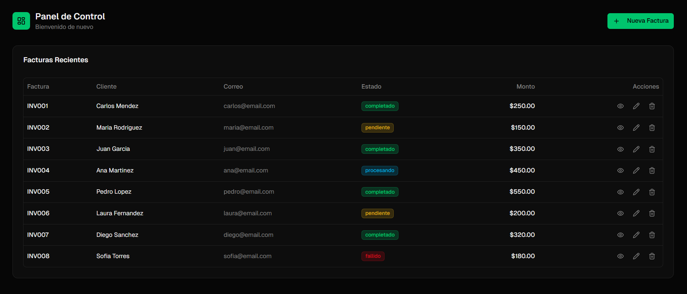
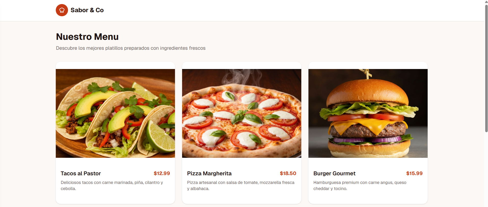

 # Retos de Maquetación (CSS o Tailwind)
 
 En este proyecto tienes 2 retos para replicar la interfaz de las imágenes de referencia, **escoge solo uno**
 
 - `dashboardfacturas.png` (tabla de facturas en modo oscuro)
 - `dashboardcards.png` (cards de menú en modo claro)
 
 Puedes resolverlos con **CSS puro** o con **TailwindCSS** (elige uno).
 
 ---
 
 ## Reglas generales
 
 - **No entregues solo el CSS**: entrega la página funcionando (HTML + estilos).
  - **Cambia la temática**: no te quedes con la temática, son solo ejemplos
 
 ---
 
 ## Reto 1: Dashboard de Facturas (Modo oscuro)
 
 **Referencia**: `dashboardfacturas.png`
 
 
 
 ### Objetivo
 Construir una pantalla de “Panel de Control” con:
 
 - Un **encabezado superior** con icono/título a la izquierda y botón “Nueva Factura” a la derecha.
 - Una **tarjeta (card) principal** que contiene una **tabla** de “Facturas Recientes”.
 
 ### Estructura sugerida (HTML)
 - `header`
   - `div` (logo + “Panel de Control” + subtítulo)
   - `button` (Nueva Factura)
 - `main`
   - `section.card`
     - `h2` Facturas Recientes
     - `div.table-wrapper`
       - `table`
 
 ### Requisitos visuales mínimos
 - Fondo general **oscuro**.
 - La tarjeta debe sentirse “elevada” (borde/sombra suave) con esquinas redondeadas.
 - Tabla con:
   - Encabezados: Factura, Cliente, Correo, Estado, Monto, Acciones.
   - Filas con buena separación (espaciado / líneas divisorias sutiles).
 - “Estado” como **badge** (ej: completado / pendiente / procesando / fallido) con colores distintos.
 - “Acciones” como 3 íconos/botones (pueden ser texto o SVG simple si no hay íconos), recomiendo explorar `font awesome`
 
 ### Checklist de entrega
 - [ ] Header alineado (izquierda/derecha) y con espaciado consistente.
 - [ ] Card centrada y con ancho máximo razonable.
 - [ ] Tabla legible: tipografía, alineación de columnas y estados tipo badge.
 - [ ] Hover/focus visibles en botones (accesibilidad básica).
 - [ ] Responsive: en pantallas pequeñas la tabla no rompe (scroll horizontal o ajuste).
 
 ---
 
 ## Reto 2: Cards de Menú (Grid + Navbar)
 
 **Referencia**: `dashboardcards.png`
 
 
 
 ### Objetivo
 Construir una página tipo restaurante con:
 
 - Barra superior simple
 - Sección con título “Nuestro Menu”, descripción y un **grid de 3 cards**.
 
 ### Estructura sugerida (HTML)
 - `header`
   - `nav`
     - `div.brand` (logo circular + “Sabor & Co”)
 - `main`
   - `section`
     - `h1` Nuestro Menu
     - `p` descripción
     - `div.grid`
       - `article.card` x3
         - `img`
         - `div.card-body`
           - `div.row` (nombre + precio)
           - `p` descripción del plato
 
 ### Requisitos visuales mínimos
 - Fondo claro con contenedor centrado.
 - Cards con:
   - Imagen arriba con bordes redondeados.
   - Nombre del plato a la izquierda y precio a la derecha.
   - Separación/espaciado consistente (padding y gap).
 - Grid:
   - 1 columna en móvil.
   - 2 columnas en tablet.
   - 3 columnas en desktop.
 
 ### Checklist de entrega
 - [ ] Navbar simple y limpia.
 - [ ] Grid responsive (1/2/3 columnas según ancho).
 - [ ] Cards consistentes (misma altura visual aproximada).
 - [ ] Imágenes ajustadas sin deformarse (cover).
 - [ ] Tipografía/jerarquía: título, subtítulo, contenido.
 
 ---
 
 ## Sugerencia de entrega
 
 - Crea una carpeta por reto (por ejemplo: `reto-1-facturas/` y `reto-2-cards/`).
 - Incluye un `index.html` por reto.
 - Si usas CSS: `styles.css`.
 - Si usas Tailwind: deja claro cómo lo estás usando.
 - Subelo a Discord con tu nombre
